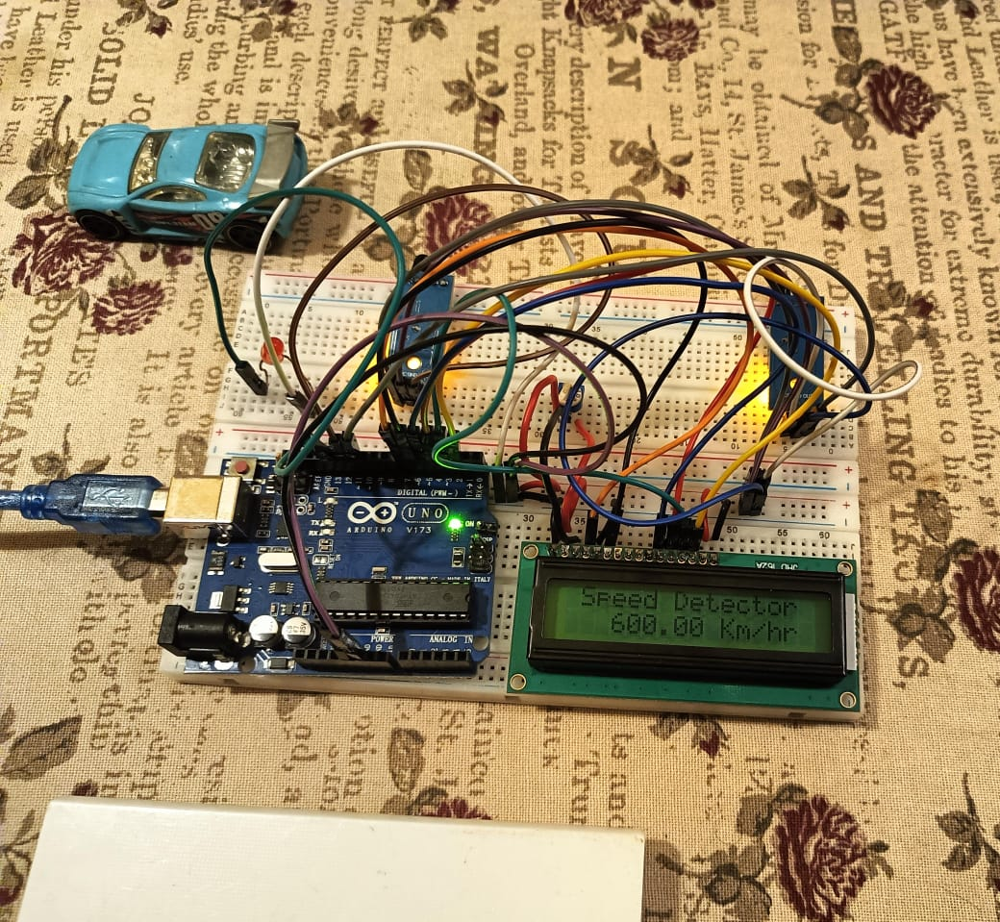
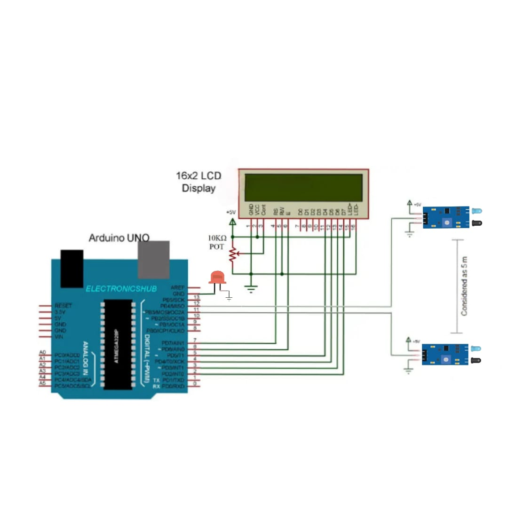

# Speed Detector using Arduino and LCD Display

This project is an Arduino-based speed detector system that uses two sensors to measure the speed of a passing object. If the detected speed exceeds a threshold (150 km/h in this example), a warning LED is triggered, and a "Warning! Speed!" message is displayed on the LCD screen.

## Features

- **Speed Calculation**: Calculates the speed of a moving object in km/h based on the time taken between two sensor activations.
- **Warning System**: Triggers a warning LED and displays a message on the LCD if the speed exceeds 150 km/h.
- **Display Reset**: Automatically resets the display and warning LED after 10 seconds of inactivity.

## Components

1. **Arduino** (e.g., Uno or similar)
2. **16x2 LCD Display**
3. **Two Infrared (IR) Sensors**
4. **LED for Warning Indicator**
5. **10k Potentiometer** (for adjusting the LCD contrast)
6. **Resistors, Jumper Wires**

## Circuit Connections

| Arduino Pin | Component            |
|-------------|-----------------------|
| D7          | LCD RS               |
| D6          | LCD Enable (EN)      |
| D5-D2       | LCD Data Pins (D4-D7)|
| D11         | Sensor 1             |
| D12         | Sensor 2             |
| D13         | Warning LED          |

**Note**: Connect the 10k potentiometer to the LCD to adjust the contrast for optimal display readability.

## How to Use

1. **Connect** the components according to the circuit diagram.
2. **Upload** the code to your Arduino board.
3. **Test** the setup by passing an object in front of the sensors.
4. **Observe** the speed on the LCD. If the speed exceeds 150 km/h, the warning LED will activate.

## License

This project is open-source and free to use and modify.

---
