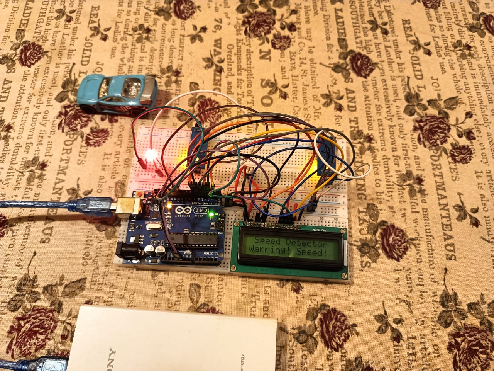
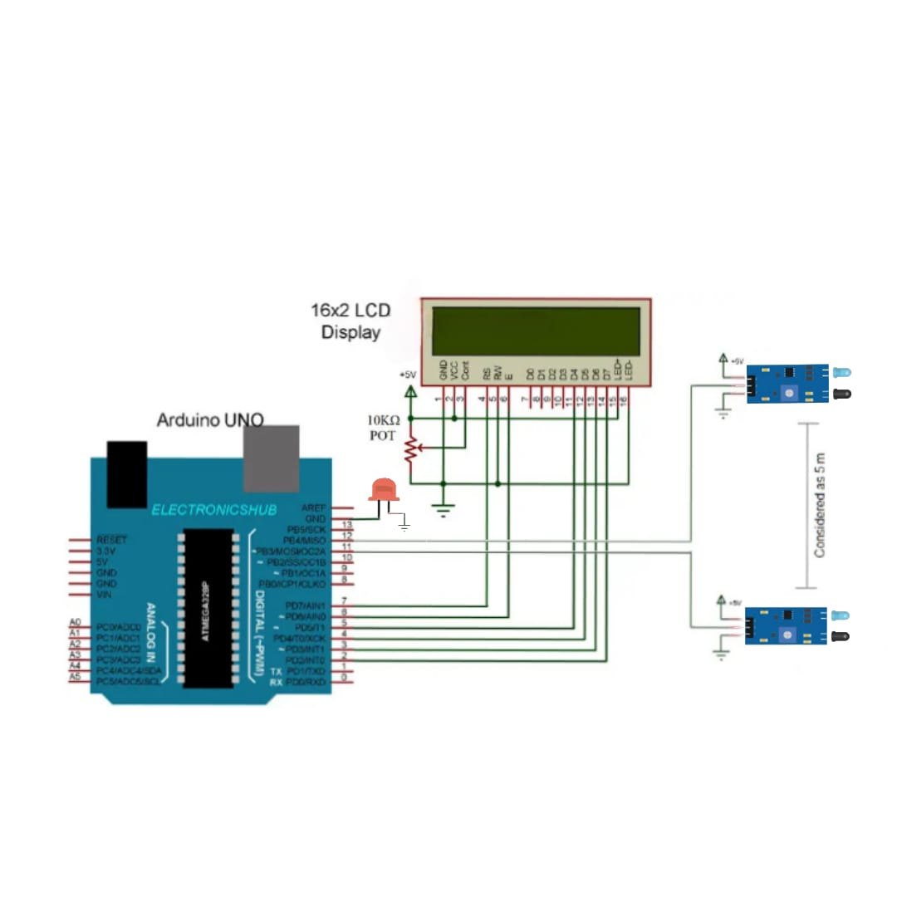
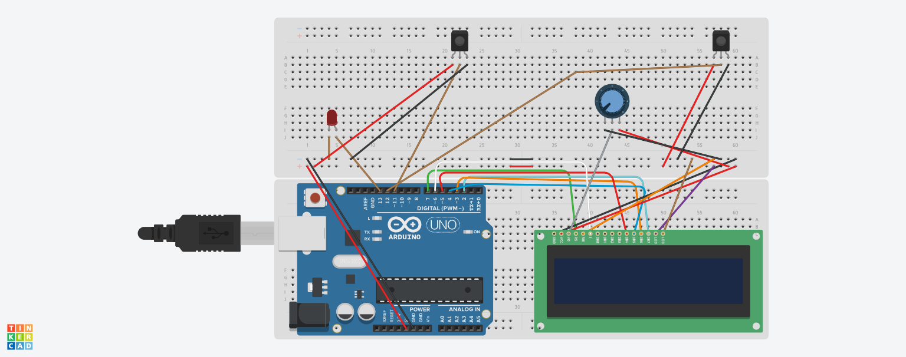

# 🚗 Speed Detector using Arduino & LCD Display

<p align="center">
  
</p>

<p align="center">
  <strong>An Arduino-based vehicle speed detection system using dual IR sensors and a 16×2 LCD display.</strong>
</p>

<p align="center">
Designed to measure the speed of moving vehicles or objects in real time and provide visual warnings when the speed exceeds a predefined limit.
</p>

---

# 📖 Overview

The **Speed Detector using Arduino & LCD Display** is an embedded systems project that measures the speed of a moving object using two **Infrared (IR) sensors** placed at a fixed distance apart.

When an object passes the first sensor, a timer starts. As the object reaches the second sensor, the timer stops. The Arduino calculates the elapsed time and determines the object's speed using the distance between the sensors.

The calculated speed is displayed on a **16×2 LCD**, and if it exceeds the predefined speed limit, a warning LED is activated and a warning message is shown on the display.

This project demonstrates the practical application of **Arduino programming, embedded systems, sensor interfacing, and real-time speed measurement**.

---

# 🎯 Project Objective

The objective of this project is to develop a simple and cost-effective speed detection system capable of measuring the speed of moving objects and generating alerts whenever the speed exceeds the allowed threshold.

---

# ✨ Features

- 🚗 Real-time speed detection
- 📡 Dual IR sensor-based measurement
- 📟 16×2 LCD speed display
- 🚨 Automatic overspeed warning
- 💡 LED indicator for speed violations
- ⚡ Fast and accurate calculations
- 🔄 Automatic display reset after inactivity
- 🛠 Simple and low-cost hardware

---

# ⚙️ Working Principle

The system operates using two IR sensors placed at a fixed distance from each other.

1. A moving object passes **Sensor 1**.
2. Arduino starts an internal timer.
3. The object reaches **Sensor 2**.
4. Arduino stops the timer.
5. The elapsed time is used to calculate speed.

The speed is calculated using the formula:

```text
Speed = Distance ÷ Time
```

The calculated value is converted into **km/h** and displayed on the LCD.

If the calculated speed exceeds **150 km/h**, the warning LED turns ON and the LCD displays an overspeed warning message.

---

# 🧠 System Workflow

```text
Vehicle
    │
    ▼
IR Sensor 1
    │
Start Timer
    │
    ▼
Vehicle Movement
    │
    ▼
IR Sensor 2
    │
Stop Timer
    │
    ▼
Arduino
    │
Calculate Speed
    │
    ▼
16×2 LCD Display
    │
    ▼
Speed > Limit?
    │
 ┌──┴───────────────┐
 │                  │
 ▼                  ▼
Normal          Warning LED
Display         LCD Warning
```

---

# 🔧 Hardware Components

| Component | Description |
|-----------|-------------|
| Arduino Uno | Main controller |
| 16×2 LCD Display | Displays speed and warnings |
| IR Sensor 1 | Starts timing |
| IR Sensor 2 | Stops timing |
| LED | Overspeed warning indicator |
| 10k Potentiometer | LCD contrast adjustment |
| Jumper Wires | Connections |
| Breadboard | Circuit assembly |

---

# 💻 Software & Tools

| Software | Purpose |
|----------|---------|
| Arduino IDE | Programming |
| Embedded C | Arduino Code |
| LiquidCrystal Library | LCD Interface |

---

# 🔌 Circuit Connections

| Arduino Pin | Connected To |
|-------------|--------------|
| D7 | LCD RS |
| D6 | LCD Enable |
| D5 | LCD D4 |
| D4 | LCD D5 |
| D3 | LCD D6 |
| D2 | LCD D7 |
| D11 | IR Sensor 1 |
| D12 | IR Sensor 2 |
| D13 | Warning LED |

**Note:** Connect a **10k potentiometer** to the LCD's contrast pin to adjust display visibility.

---

# 🚀 Installation

## Clone Repository

```bash
git clone https://github.com/joshua14134/Speed-Detector-using-Arduino.git

cd Speed-Detector-using-Arduino
```

---

## Upload Arduino Code

1. Open Arduino IDE.
2. Open the project `.ino` file.
3. Select your Arduino board.
4. Select the correct COM Port.
5. Upload the sketch.

---

## Hardware Setup

- Connect all components according to the circuit diagram.
- Place both IR sensors at a known fixed distance.
- Power the Arduino board.
- Adjust LCD contrast using the potentiometer.

---

# 📷 Project Demonstration

## Complete Project

<p align="center">

</p>

---

## Circuit Diagram

<p align="center">

</p>

---

## Proteus Simulation

<p align="center">

</p>

---

# 📊 Results

The system successfully detects the speed of moving objects by measuring the travel time between two infrared sensors.

The measured speed is displayed on the LCD in real time.

Whenever the detected speed exceeds the predefined limit of **150 km/h**, the warning LED activates and the LCD displays a warning message, helping identify overspeeding objects instantly.

---

# 💡 Applications

- Vehicle Speed Monitoring
- Traffic Management Systems
- Educational Projects
- Embedded Systems Learning
- Highway Speed Detection
- Industrial Conveyor Monitoring
- Smart Transportation Systems

---

# 🚀 Future Improvements

- 📷 Camera Integration
- 🌐 IoT Monitoring
- ☁ Cloud Data Logging
- 📱 Mobile App Integration
- 📡 Wireless Communication
- 💾 SD Card Data Logging
- 🔊 Voice Alert System
- 🚔 Automatic Number Plate Recognition (ANPR)
- 📊 Web Dashboard

---

# 📚 Learning Outcomes

This project demonstrates practical implementation of:

- Arduino Programming
- Embedded Systems
- IR Sensor Interfacing
- LCD Programming
- Real-Time Speed Calculation
- Digital Electronics
- Microcontroller Applications
- Sensor-Based Automation

---

# 👨‍💻 Developer

**Joshua Greg Colaco**

GitHub: **https://github.com/joshua14134**

---

# 📄 License

This project is licensed under the **MIT License**.

---

<p align="center">
❤️ Built with Arduino and Embedded Systems for real-time speed monitoring.
</p>

<p align="center">
⭐ If you found this project useful, consider giving it a <b>Star</b> on GitHub.
</p>
